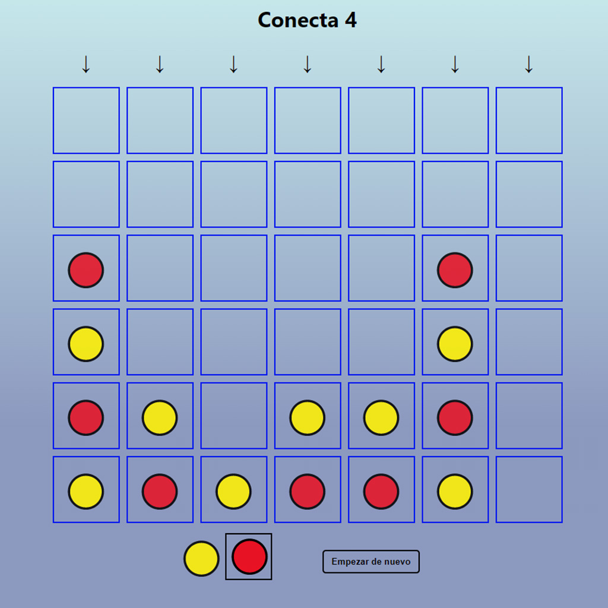

# Conecta 4

One of my most recent projects. To put my current knowledge and programming logic into practice, I decided to create this classic game where to win you have to connect four tiles of the same colour horizontally, vertically or diagonally. It is a project where the use of React's useState is predominant.

## Table of Contents

* [General Info](#general-information)
* [Technologies Used](#technologies-used)
* [Features](#features)
* [Screenshots](#screenshots)
* [Contact](#contact)

## General Information

- Classic 1 vs 1 Game.

## Technologies Used

- HTML5 - SASS - Javascript - React

## Screenshots

## Contact

Created by [Adrian Kervin](https://www.linkedin.com/in/kervinmarquinez/) - feel free to contact!